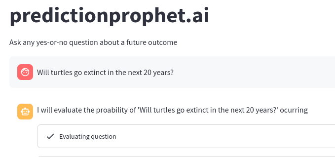
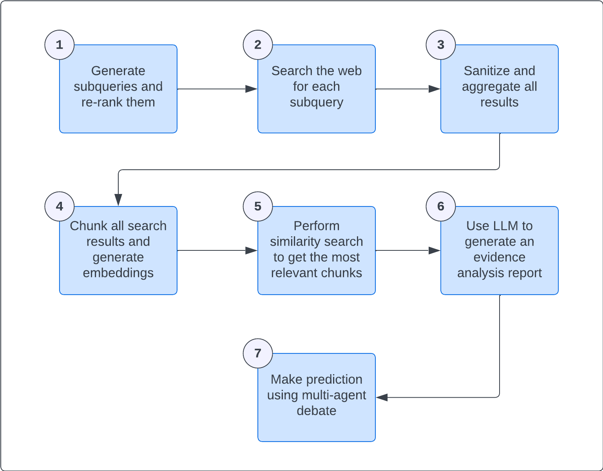

# Prediction Prophet


---

[Discord](https://discord.gg/k7UCsH3ps9) | [Website](https://predictionprophet.ai) | :star: the repo !  

---

## Welcome!

Prediction Prophet is an agent that specializes in making informed predictions, based on web research. To try it yourself head to [predictionprophet.ai](https://predictionprophet.ai) or build and run from source following these [setup instructions](#setup).



## Need Help?

Join our [Discord community](https://discord.gg/k7UCsH3ps9) for support and discussions.

[](https://discord.com/invite/k7UCsH3ps9)

If you have questions or encounter issues, please don't hesitate to [create a new issue](https://github.com/polywrap/predictionprophet/issues/new) to get support.


## How It Works


To elaborate further, given a question like `"Will Twitter implement a new misinformation policy before the 2024 elections?"`, Prophet will:  

1. Generate `n` web search queries and re-ranks them using an LLM call, selecting only the most relevant ones
2. Search the web for each query, using [Tavily](https://tavily.com/)
3. Scrape and sanitize the content of each result's website
4. Use Langchain's `RecursiveCharacterTextSplitter` to split the content of all pages into chunks and create embeddings. All chunks are stored with the content as metadata.
5. Iterate over the queries selected on step `1` and vector search for the most relevant chunks created in step `4`.
6. Aggregate all relevant chunks and prepare a report.
7. Make a prediction.

## Setup

### Installation

1. Clone the repository 
    > `git clone https://github.com/polywrap/predictionprophet`
2. Copy the `.env.template` file and rename it to `.env`.  
    > `cp .env.template .env`
3. Find the line that says OPENAI_API_KEY=, and add your unique [OpenAI](https://openai.com/) API Key  
    > `OPENAI_API_KEY=sk-...`
4. Find the line that says TAVILY_API_KEY=, and add your unique [Tavily](https://tavily.com/) API Key  
    > `TAVILY_API_KEY=tvly-...`
5. Install all dependencies
    > `poetry install`
6. Enter the python environment
    > `poetry shell`

Now you're ready to go!

### Predict

```bash
poetry run predict "Will Twitter implement a new misinformation policy before the 2024 elections?"
```

### Research

```bash
poetry run research "Will Twitter implement a new misinformation policy before the 2024 elections?"
```

### Front-End

```bash
poetry run streamlit run ./prediction_prophet/app.py
```

## Possible Future Improvements

### For the researcher:

- Using LLM re-ranking, like [Cursor](https://twitter.com/amanrsanger/status/1732145826963828997?s=03) to optimize context-space and reduce noise
- Use [self-consistency](https://www.promptingguide.ai/techniques/consistency) and generate several reports and compare them to choose the best, or even merge information
- Plan research using more complex techniques like [tree of thoughts](https://arxiv.org/abs/2305.10601)
- Implement a research loop, where research is performed and then evaluated. If the evaluation scores are under certain threshold, re-iterate to gather missing information or different sources, etc.
- Perform web searches under different topic or category focuses like [Tavily](https://app.tavily.com/home) does. For example, some questions benefit more from a "social media focused" research: gathering information from twitter threads, blog articles. Others benefit more from prioritizing scientific papers, institutional statements, and so on.
- Identify strong claims and perform sub-searches to verify them. This is the basis of AI powered fact-checkers like: https://fullfact.org/
- Evaluate sources credibility
- Further iterate over chunking and vector-search strategies
- Use [HyDE](https://medium.com/@juanc.olamendy/revolutionizing-retrieval-the-mastering-hypothetical-document-embeddings-hyde-b1fc06b9a6cc)

### For the information evaluator/grader

- Use [self-consistency](https://www.promptingguide.ai/techniques/consistency) to generate several scores and choose the most repeated ones.
- Enhance the evaluation and reduce its biases through the implementation of more advanced techniques, like the ones described here https://arxiv.org/pdf/2307.03025.pdf and here https://arxiv.org/pdf/2305.17926.pdf
- Further evaluate biases towards writing-style, length, among others described here: https://arxiv.org/pdf/2308.02575.pdf and mitigate them
- Evaluate using different evaluation criteria
